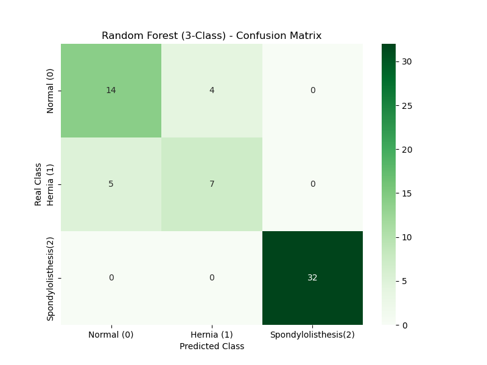

# 🩺 Biomechanical Features of Orthopedic Patients - Classification Project

This project focuses on classifying orthopedic patient data into categories using Machine Learning. It explores both binary (2-Class: Normal vs Abnormal) and multi-class (3-Class: Normal, Disk Hernia, Spondylolisthesis) problems using the **Random Forest Classifier**.

---

## 📊 Dataset Information
The dataset contains biomechanical attributes derived from the shape and orientation of the pelvis and lumbar spine:
- Pelvic Incidence
- Pelvic Tilt
- Lumbar Lordosis Angle
- Sacral Slope
- Pelvic Radius
- Degree Spondylolisthesis

---

## 🛠️ Project Workflow & Engineering Insights

1. **Data Preprocessing & Encoding:**
   - Handled categorical string targets by mapping them to numeric representations (`Normal: 0`, `Hernia: 1`, `Spondylolisthesis: 2`).
   - Cleaned implicit trailing whitespaces from strings to prevent mapping errors (`NaN` handling).

2. **Model Training:**
   - Evaluated **Random Forest Classifier** with hyperparameter tuning (`n_estimators=500`).
   - Used an 80/20 train-test split (`random_state=42`).

3. **Performance & Results:**
   - **2-Class Model Accuracy Score (n_estimators = 500):** `~82.26%`
   - **3-Class Model Accuracy Score:** `~85.48%`
   - **Key Finding of 3C:** The model achieved near-perfect accuracy on detecting *Spondylolisthesis*, while most false classifications occurred between early-stage *Hernia* and *Normal* patients due to similar biomechanical features.

---

## 📈 Confusion Matrix
.png)


---

## 🚀 How to Run
```bash
# Clone the repository
git clone [https://github.com/aoktayzkn/orthopedic-patients-classification.git](https://github.com/aoktayzkn/orthopedic-patients-classification.git)

# Install required libraries
pip install pandas numpy scikit-learn seaborn matplotlib

# Run the script
python biomechanical_with_3.py
